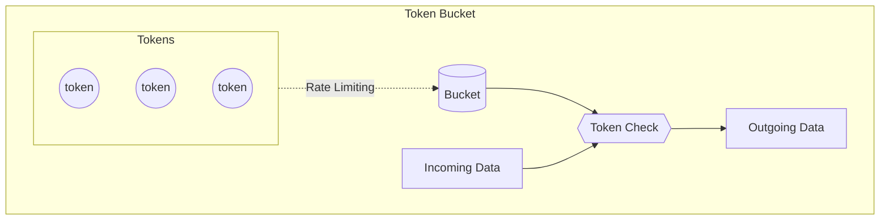

# Traffic policing algorithms in GO

## Token Bucket

### Overview

The token bucket algorithm is based on an analogy of a fixed capacity bucket into which tokens, normally representing a unit of bytes or a single packet of predetermined size, are added at a fixed rate. When a packet is to be checked for conformance to the defined limits, the bucket is inspected to see if it contains sufficient tokens at that time. If so, the appropriate number of tokens, e.g. equivalent to the length of the packet in bytes, are removed ("cashed in"), and the packet is passed, e.g., for transmission. The packet does not conform if there are insufficient tokens in the bucket, and the contents of the bucket are not changed. Non-conformant packets can be treated in various ways:

- They may be dropped. **(Current Implementation)**
- They may be enqueued for subsequent transmission when sufficient tokens have accumulated in the bucket.
- They may be transmitted, but marked as being non-conformant, possibly to be dropped subsequently if the network is overloaded.

A conforming flow can thus contain traffic with an average rate up to the rate at which tokens are added to the bucket, and have a burstiness determined by the depth of the bucket. This burstiness may be expressed in terms of either a jitter tolerance, i.e. how much sooner a packet might conform (e.g. arrive or be transmitted) than would be expected from the limit on the average rate, or a burst tolerance or maximum burst size, i.e. how much more than the average level of traffic might conform in some finite period.

### Algorithm

The token bucket algorithm can be conceptually understood as follows:

- A token is added to the bucket every $1 \over r$ seconds.
- The bucket can hold at the most $b$ tokens. If a token arrives when the bucket is full, it is discarded.
- When a packet (network layer PDU) of n bytes arrives,
  - if at least n tokens are in the bucket, n tokens are removed from the bucket, and the packet is sent to the network.
  - if fewer than n tokens are available, no tokens are removed from the bucket, and the packet is considered to be non-conformant.

### Diagram

### References

[Token Bucket Wiki](https://www.wikiwand.com/en/Token_bucket)

## Leaky Bucket

### Overview
The leaky bucket is an algorithm based on an analogy of how a bucket with a constant leak will overflow if either the average rate at which water is poured in exceeds the rate at which the bucket leaks or if more water than the capacity of the bucket is poured in all at once. It can be used to determine whether some sequence of discrete events conforms to defined limits on their average and peak rates or frequencies, e.g. to limit the actions associated with these events to these rates or delay them until they do conform to the rates. It may also be used to check conformance or limit to an average rate alone, i.e. remove any variation from the average.

### Algorithm

- A fixed capacity bucket, associated with each virtual connection or user, leaks at a fixed rate.
- If the bucket is empty, it stops leaking.
- For a packet to conform, it has to be possible to add a specific amount of water to the bucket: The specific amount added by a conforming packet can be the same for all packets or can be proportional to the length of the packet.
- If this amount of water would cause the bucket to exceed its capacity then the packet does not conform and the water in the bucket is left unchanged.

### References

[Leaky Bucket Wiki](https://www.wikiwand.com/en/Leaky_bucket)

